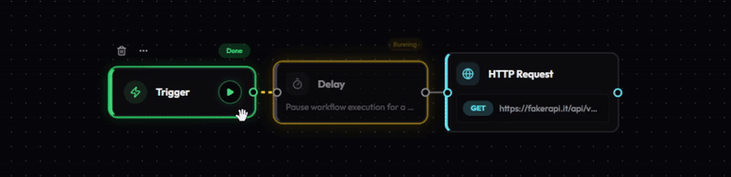

<h1 align="center">
  <picture>
    <source media="(prefers-color-scheme: dark)" srcset="media/logo_white.svg">
    
  </picture>
  <span style="vertical-align: middle;">ynode</span>
</h1>

<p align="center">
  <strong>Open-source visual workflow automation.</strong><br />
  Built for everyone
</p>

<p align="center">
  <a href="#quick-start">Quick Start</a> •
  <a href="packages/ynode-core/README.md">Core</a> •
  <a href="packages/ynode-cli/README.md">CLI</a> •
  <a href="#license">License</a>
</p>

<div align="center">


</div>

<p align="center">
  
</p>

---

## ✨ Features

- **Visual Builder** - Intuitive node-based editor powered by React Flow.
- **Extensible** - Add custom nodes easily via CLI.
- **Secure** - Built-in encryption for credentials + you hold your data.
- **Monorepo** - Clean architecture using pnpm workspaces.

## 🏗️ FullStack Structure

```text
ynode/
├── packages/
│   ├── 🛠️ ynode-core      # Shared types, node definitions, & serialization
│   └── 💻 ynode-cli       # Development tools (scaffolding & validation)
├── ynode-app          # Frontend (React + Vite + React Flow)
└── ynode-server       # Backend (Express + SQLite + WebSocket)
```

## Quick Start

### 1. Requirements

Ensure you have [pnpm](https://pnpm.io/) and [Node.js](https://nodejs.org/) installed.

### 2. Installation

```bash
# Clone the repository
git clone https://github.com/iamyureka/ynode.git
cd ynode

# Install all dependencies
pnpm install

# Build the core library
pnpm --filter @ynode/core build
```

### 3. Run Development Servers

Open two terminals or use a task runner:

```bash
# Terminal 1: Backend
pnpm --filter ynode-server dev

# Terminal 2: Frontend
pnpm --filter ynode-app dev
```

- **App**: [http://localhost:5173](http://localhost:5173)
- **API**: [http://localhost:3001](http://localhost:3001)

## 🎮 Canvas Controls

- **Left Drag** - Draw selection box to multi-select nodes.
- **Right Drag** - Pan across the canvas.
- **Ctrl + Click** - Toggle individual node selection.
- **Key [C]** - Wrap selected nodes in a comment/group box.
- **Key [Delete/Backspace]** - Remove selected nodes.
- **Ctrl + [C/V/D]** - Copy, Paste, or Duplicate selected nodes.

## 🛠️ Custom Nodes

To create a new node, you can use the CLI
For detailed instructions, see the [CLI Documentation](packages/ynode-cli/README.md).

---

## Support

If ynode helps your workflow, consider supporting its development:
☕ [Buy Me a Coffee](https://paypal.me/bangmey)
